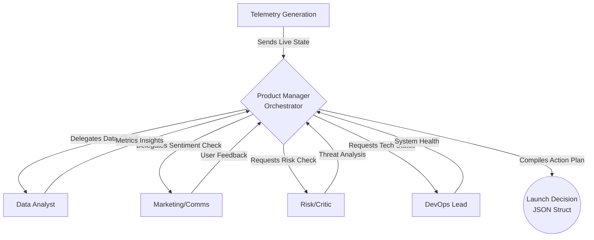

# 🚀 AI-Powered Multi-Agent War Room Simulator

## 📌 Overview

This repository contains a **dynamic, multi-agent simulation** of a cross-functional product launch "War Room." The system evaluates simulated post-launch data alongside qualitative user feedback to autonomously render a tactical Launch Decision ("Proceed," "Pause," or "Roll Back").

It combines:
* Dynamic Scenario Generation
* Multi-agent autonomous persona collaboration
* Real-time telemetry dashboard
* Premium glassmorphism frontend 

---

## 🧠 Key Features

* 🔍 Real-time telemetry evaluation (latencies, ticket volumes, payment success rates)
* 🤖 5-Agent Architecture
* 📊 Real-time Dashboard with Server-Sent Events (SSE) streaming
* ⚡ FastAPI Backend & Native Web UI
* 💻 Dynamic Offline Mode (No expensive LLM inference credits needed)

---

## 🏗️ System Architecture



---

## 🤖 Agents Description

### 1. Product Manager Agent
* Acts as the Orchestrator
* Consolidates inputs and makes final structured decision (Proceed/Pause/Roll Back)

### 2. Data Analyst Agent
* Evaluates quantitative metrics (e.g., payment success rate, active sessions)
* Identifies trends and data anomalies

### 3. DevOps Lead Agent
* Monitors technical health (API latencies, server error rates)
* Suggests scaling or rollback procedures

### 4. Risk / Critic Agent
* Identifies regulatory or compliance risks
* Plays devil's advocate for any optimistic assessments

### 5. Marketing & Comms Agent
* Analyzes qualitative user feedback (e.g., Twitter sentiment)
* Drafts user-facing communications based on launch health

---

## ⚙️ Tech Stack

| Layer           | Technology             |
| --------------- | ---------------------- |
| Backend         | FastAPI, Uvicorn       |
| Frontend        | Vanilla HTML/CSS/JS, SSE |
| AI Architecture | Multi-Agent Simulation |
| API Testing     | Postman / Browser      |

---

## 📁 Project Structure

```
project-root/
│
├── backend/
│   ├── main.py
│   ├── agents.py
│   ├── data.py
│   └── tools.py
│
├── frontend/
│   ├── index.html
│   ├── style.css
│   └── script.js
│
├── requirements.txt
└── README.md
```

---

## 🔑 Environment Variables

Currently, the war room has been upgraded to a **Dynamic Offline Mode** to ensure 100% reliable execution during demos without hitting `429 Too Many Requests` or API billing blocks.

Because of this, **no environment variables are specifically required** to successfully run the simulation. *(If you wish to fork and attach a live LLM, you may supply API keys via a `.env` file.)*

---

## ⚡ Installation & Setup

### 1. Clone Repository
```bash
git clone <repo_url>
cd ai-war-room
```

### 2. Install Dependencies
Make sure you have Python 3.9+ installed.
```bash
pip install -r requirements.txt
```

---

## ▶️ Running the Project

### Start FastAPI Server
From the project root (`c:\ai-war-room`):
```bash
uvicorn backend.main:app --host 0.0.0.0 --port 8000
```

### Open the Dashboard
Navigate to:
```
http://localhost:8000
```
As soon as the page mounts, it dynamically requests current launch telemetry and populates the dashboard (Green = Healthy, Red = Critical).

---

## 📡 Simulation Usage

### Initialize the Protocol
Click the **"Initialize Protocol"** button in the top right corner. The agent swarm will begin streaming logic via the Comms Channel right beside the data panel. 

Upon conclusion, the Product Manager will deliver the structured JSON decision containing the `rationale`, `action_plan`, and `risk_register` via a modal overlay.

---

## 🧪 Reproducing Results 

Because the simulated reality is random, reproducing different War Room output sets relies on simple repetition:

* **Generate Novel Dashboards**: Simply refresh your browser tab (`F5` or `Ctrl+R`). The telemetry API will roll a new state.
* **Run Simulation on Specific State**: After refreshing until you see a "Spiking Latency" dashboard, click "Initialize Protocol." The agents will adapt their findings and recommend a "Roll Back." Refresh until you see a healthy dashboard, and the agents will determine to "Proceed" with 99% confidence.

---

## 🧠 Advanced Features

### Real-Time UI Streaming
* Constant polling/event streams via Server-Sent Events (SSE)
* Displays agent thoughts sequentially as they reason

### Premium Design Aesthetics
* Deep glassmorphism interface focusing on immersive dark-mode UX

---

## 🧩 Future Improvements
* Integration with live metrics tools (Datadog/NewRelic)
* Integration with a live Orchestration framework like LangGraph
* User interaction/interruption during agent debate

---

## ⭐ Tips for Evaluation

* Highlight the multi-agent design framework
* Demonstrate the UI responsiveness to random server states
* Emphasize the deterministic fallback (offline-mode) solving standard API limitations

---

## 🎥 Demo Script (Quick)

1. Start server
2. Open Browser to localhost:8000
3. Explain the populated dashboard (Healthy vs Erroring services)
4. Click "Initialize Protocol"
5. Watch Comms Channel stream and review the final decision modal

---

## 📌 Conclusion

This project demonstrates:

* Strong AI system design concepts
* Multi-agent communication
* Premium responsive UI design
* Fast and robust Python-based API orchestration

---
